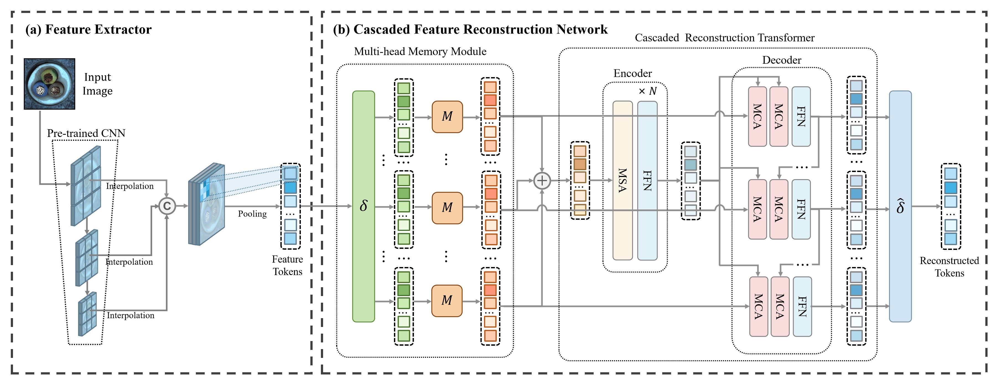

>📋  A template README.md for code accompanying a Machine Learning paper

# MGCFR

This repository contains the source code for the official implementation in PyTorch of "Multi-head Memory Guided Cascaded Feature Reconstruction For Multi-Class Unsupervised Anomaly Localization" . 



## Dependencies

```setup
torch==1.9.0
torchvision==0.10.0
PyYAML==6.0.1
easydict==1.10
tensorboardX==2.6.2.2
opencv-python==3.4.2.16
numpy==1.19.5
einops==0.4.1
tabulate==0.8.10
scikit-learn==0.24.2
Pillow==8.4.0
```


## Training

To train the model(s) in the paper, run this command:

```train
python train.py --input-data <path_to_data> --alpha 10 --beta 20
```

>📋  Describe how to train the models, with example commands on how to train the models in your paper, including the full training procedure and appropriate hyperparameters.

## Evaluation

To evaluate my model on ImageNet, run:

```eval
python eval.py --model-file mymodel.pth --benchmark imagenet
```

>📋  Describe how to evaluate the trained models on benchmarks reported in the paper, give commands that produce the results (section below).

## Pre-trained Models

You can download pretrained MGCFR models here:
- [MGCFR checkpoint](https://drive.google.com/file/d/1Le7mzFqhKKVpPLqweuSo_nO1Urm-7BrQ/view?usp=drive_link) trained on all categories of MVTec-AD dataset. 
- [MGCFR checkpoint](https://drive.google.com/file/d/1oUcUT1qM8ScR91-zIQjXxYuNlR7miDuw/view?usp=drive_link) trained on all categories of VisA dataset. 


## Results

Our model achieves the following performance on:


### MVTec-AD
| Model name | Detection AUROC | Localization AUROC |
|------------|-----------------|--------------------|
| MGCFR      | 99.0            | 98.1               |
### VisA
| Model name | Detection AUROC | Localization AUROC |
|------------|-----------------|--------------------|
| MGCFR      | 94.4            | 98.9               |


## Contributing

>📋  Pick a licence and describe how to contribute to your code repository. 